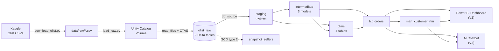
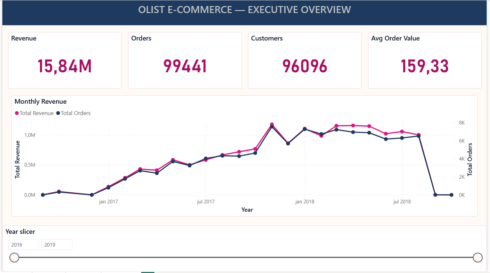
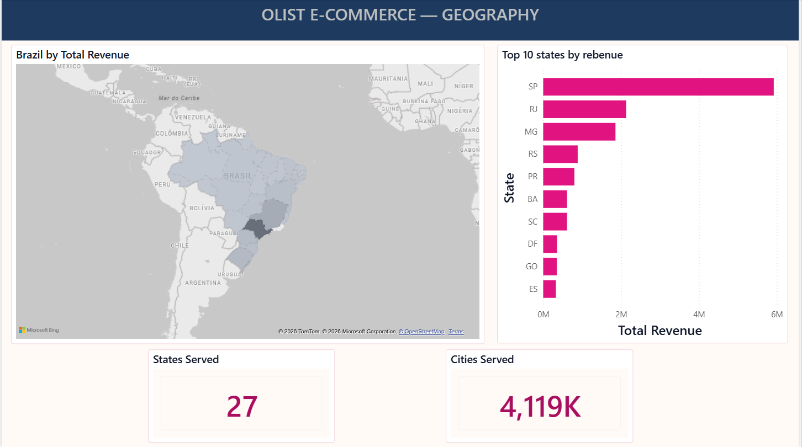
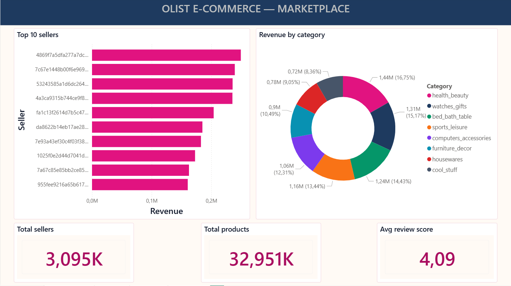
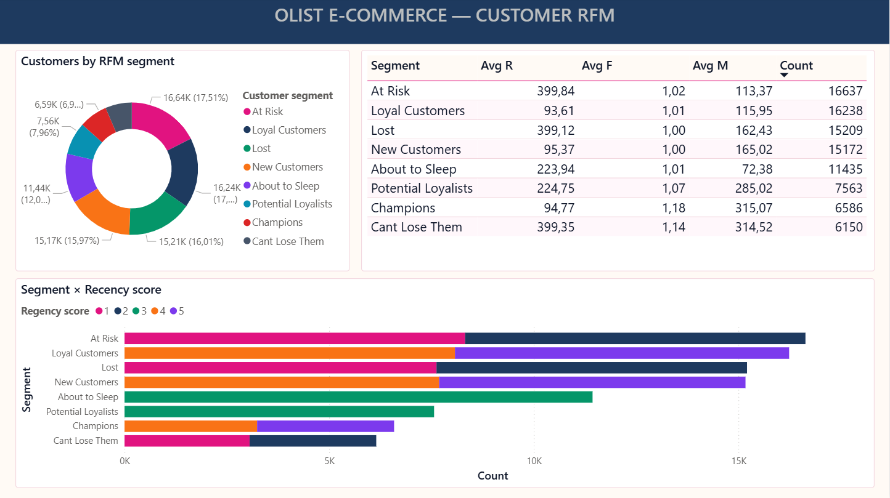

# dbt-sql-agent-powerbi

> End-to-end analytics engineering on Olist Brazilian E-Commerce: **Kaggle → Databricks (dbt) → Power BI dashboard + AI chatbot**.

Single repo demonstrating a senior-level dbt project on Databricks Lakehouse, with two consumer-facing surfaces built on top of the same curated marts.

**Status:** V1 complete (core dbt) · V2 Bonus 1 chatbot done (90% eval pass) · V2 Bonus 2 Power BI done · V2 Bonus 3 HF Spaces pending

---

## Architecture



---

## Stack

| Layer | Tool | Why |
|---|---|---|
| Transformation | **dbt-core** 1.9 + **dbt-databricks** adapter | Industry-standard analytics engineering tool |
| Warehouse | **Databricks Free Edition** (serverless SQL warehouse + Unity Catalog) | Real lakehouse for the CV; $0 free tier |
| Ingestion | Python + `databricks-sdk` Files API + `read_files()` CTAS | Modern UC pattern; idempotent; ~2 min for 1.5M rows |
| Dataset | **Olist Brazilian E-Commerce** (Kaggle `olistbr/brazilian-ecommerce`) | Rich marketplace data: orders, sellers, customers, reviews, geolocation |
| Tests | dbt built-ins + `dbt_utils` (1.3.0) | 77 tests, all PASS |
| Docs | `dbt docs generate` + Mermaid (architecture) | Auto-generated lineage + manual diagrams |
| BI (V2) | Power BI Desktop via ODBC | `.pbix` versioned, screenshots + screen-capture demo |
| Chatbot (V2) | FastAPI + LLM + `databricks-sql-connector` | NL question → SQL → Databricks |

---

## Quick start

> Requires: Python 3.11+, [Databricks Free Edition](https://www.databricks.com/learn/free-edition) workspace with a SQL warehouse, and a [Kaggle API token](https://www.kaggle.com/settings) at `~/.kaggle/kaggle.json`.

```powershell
# 1. Clone + venv + install
git clone <repo-url> dbt-sql-agent-powerbi
cd dbt-sql-agent-powerbi
python -m venv .venv
.\.venv\Scripts\Activate.ps1
pip install -r requirements.txt

# 2. Fill the .env (see .env.example for every variable)
copy .env.example .env
notepad .env

# 3. Add the dbt profile (or append to existing ~/.dbt/profiles.yml)
copy dbt\profiles.yml.example $env:USERPROFILE\.dbt\profiles.yml

# 4. Download Olist + load into Unity Catalog (~2 min)
python ingestion/scripts/download_olist.py
dotenv -f .env run -- python ingestion/scripts/load_raw.py

# 5. Build + test everything
dotenv -f .env run -- dbt deps --project-dir dbt
dotenv -f .env run -- dbt build --project-dir dbt
```

After step 5 you should see `Done. PASS=77 WARN=0 ERROR=0 SKIP=0 TOTAL=77`.

Browse the docs locally:

```powershell
dotenv -f .env run -- dbt docs generate --project-dir dbt
dotenv -f .env run -- dbt docs serve --project-dir dbt
```

---

## Models

| Layer | Models | Materialization |
|---|---|---|
| **staging** (9) | `stg_customers`, `stg_geolocation`, `stg_order_items`, `stg_order_payments`, `stg_order_reviews`, `stg_orders`, `stg_products`, `stg_sellers`, `stg_product_category_translation` | view |
| **intermediate** (3) | `int_geolocation_centroid` (table), `int_order_revenue`, `int_order_payments_pivoted` | ephemeral except geo |
| **marts — dims** (4) | `dim_date`, `dim_customer`, `dim_product`, `dim_seller` | table |
| **marts — facts** (2) | `fct_orders`, `mart_customer_rfm` | table |
| **snapshots** (1) | `snapshot_sellers` (SCD type 2 on city/state) | snapshot |

**Macros:** `generate_schema_name` (override default), `pivot_payment_methods` (dynamic pivot via `dbt_utils.get_column_values`).

---

## Test results

| Test type | Count | Pass rate |
|---|---:|---:|
| `unique` | 12 | 100% |
| `not_null` | 36 | 100% |
| `accepted_values` | 13 | 100% |
| `relationships` | 2 | 100% |
| `dbt_utils.unique_combination_of_columns` | 2 | 100% |
| **Total** | **77** | **100%** |

Captured from `dbt build` against `target=dev` (Databricks Free Edition).

---

## Repository layout

```
.
├── PRD.md                          Project requirements & roadmap
├── README.md                       This file
├── requirements.txt                Pinned Python deps
├── .env.example                    Template — fill and rename to .env
│
├── ingestion/scripts/
│   ├── download_olist.py           Kaggle API -> data/raw/
│   └── load_raw.py                 data/raw/ -> Unity Catalog Volume -> Delta tables
│
├── dbt/
│   ├── dbt_project.yml             Project config
│   ├── packages.yml                dbt_utils
│   ├── profiles.yml.example        Adapter config template
│   ├── models/
│   │   ├── staging/                9 stg_*.sql + _sources.yml + _models.yml
│   │   ├── intermediate/           3 int_*.sql + _models.yml
│   │   └── marts/                  dim_*, fct_*, mart_* + _dims.yml + _facts.yml
│   ├── macros/                     generate_schema_name + pivot_payment_methods
│   └── snapshots/                  snapshot_sellers (SCD2)
│
├── backend/                        V2 — FastAPI chatbot
├── powerbi/                        V2 — .pbix + screenshots + screen-capture demo
└── docs/                           Architecture diagrams, extra docs
```

---

## Power BI dashboard (V2 Bonus 2)

Four-page interactive dashboard against the dbt marts, themed with the
Olist Brand palette (`powerbi/theme.json`) — magenta primary + navy
secondary + cream background, Segoe UI / Bahnschrift fonts (native Windows).

| Page | Visuals |
|---|---|
| Executive | 4 KPI cards (Revenue, Orders, Customers, AOV) + dual-axis monthly revenue line + year slicer |
| Geography | Brazil filled map shaded by revenue + Top 10 states bar + States/Cities cards |
| Marketplace | Top 10 sellers bar + Revenue by category donut + Sellers/Products/Avg-review cards |
| Customer RFM | Segment donut + summary table (avg R/F/M + count) + segment × recency stacked bar |






Open [`powerbi/olist_dashboard.pbix`](powerbi/olist_dashboard.pbix) in
Power BI Desktop to interact. Live demo: [`powerbi/screenshots/demo.gif`](powerbi/screenshots/demo.gif).

---

## AI chatbot (V2 Bonus 1)

FastAPI backend + reused `sql-agent` React frontend. LangGraph state machine
walks NL → SQL → validate → execute against Databricks → render Plotly →
stream tokens back over SSE. LangFuse traces every node.

Evaluation harness ([`eval/run_eval.py`](eval/run_eval.py)) runs 10
programmatic NL questions against the live backend and asserts SQL
substrings, table references, row counts, and known top-row values.

| Metric | Value |
|---|---|
| Eval questions | 10 (across all 7 marts) |
| Baseline pass rate | **90 %** (target ≥ 80 %) |
| Median latency | ~12 s/question (warehouse warm) |

Run locally:

```powershell
dotenv -f .env run -- uvicorn app.main:app --app-dir backend  # terminal 1
cd frontend; npm run dev                                       # terminal 2
# open http://localhost:5173
```

---

## Roadmap

- **V1 — Core dbt:** ✅ done (91 tests PASS)
- **V2 — Bonuses:**
  - ✅ Bonus 1 — AI chatbot (FastAPI + LangGraph + LangFuse + 10Q eval, 90 % PASS)
  - ✅ Bonus 2 — Power BI dashboard (4 pages, Olist Brand theme, screenshots + demo gif)
  - ⏳ Bonus 3 — HF Spaces deploy of the chatbot (single Docker image, public URL)
- **V3 — Stretch:**
  - GitHub Actions running `dbt build` on PR against a `ci_*` schema
  - LLM-as-judge layer on top of the programmatic eval

See [PRD.md](PRD.md) for the full design and decisions log.

---

## Dataset

[Olist Brazilian E-Commerce Public Dataset](https://www.kaggle.com/datasets/olistbr/brazilian-ecommerce) by Olist, licensed CC BY-NC-SA 4.0.
