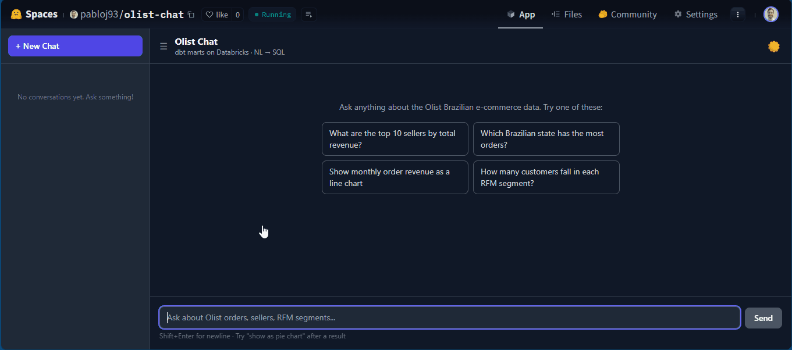
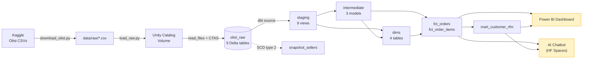

# olist-analytics

> End-to-end analytics on the Olist Brazilian e-commerce dataset — **dbt on Databricks Lakehouse → curated marts → Power BI dashboard + AI chatbot** packaged as a single portfolio project. Demonstrates the modern data stack from raw CSV ingestion to consumer surfaces, with evaluation discipline and a public live demo.

[](https://www.python.org/downloads/)
[](https://www.getdbt.com)
[](https://www.databricks.com)
[](https://fastapi.tiangolo.com)
[](https://langchain-ai.github.io/langgraph/)
[](https://powerbi.microsoft.com)
[](LICENSE)
[](https://huggingface.co/spaces/pabloj93/olist-chat)

---



---

## ✨ What this demonstrates

- **Analytics engineering at scale** — 9 staging views, 3 intermediates, 4 dims, 2 facts, 1 RFM mart, 1 SCD-type-2 snapshot, 2 custom macros — **91 dbt tests all passing**
- **Modern lakehouse pattern** — Databricks Unity Catalog (catalog → schema → volume), Delta tables, idempotent ingestion via `databricks-sdk` Files API + `read_files()` CTAS
- **Star schema done right** — `fct_orders` (order grain) and `fct_order_items` (line-item grain) sharing the same dim conformance, plus a person-level RFM mart
- **NL → SQL chatbot** over the curated marts — LangGraph state machine with SQL validation, auto-retry, Plotly visualization, SSE streaming, LangFuse tracing
- **Evaluation discipline** — 10 hand-curated NL questions, **90% pass rate** on first run (target ≥80%), results saved as timestamped JSON
- **Power BI dashboard** — 4-page interactive .pbix on a custom Olist-branded theme (magenta/navy), connected to the dbt marts via Import mode
- **Two facts, one truth** — chatbot and Power BI read from the **same dbt marts**, guaranteeing the chart and the chat agree on every number
- **Full-stack delivery** — dbt + FastAPI + React/Vite + Tailwind + Docker, single-container deploy on Hugging Face Spaces
- **Multi-language UX** — the chatbot answers in the user's language (Portuguese for the analyst persona, English for international recruiters — same code)

---

## 🏗️ Architecture



**Pipeline (one-time setup):**

1. `download_olist.py` pulls the Kaggle dataset to `data/raw/*.csv`
2. `load_raw.py` uploads CSVs to a Unity Catalog Volume, then `CREATE OR REPLACE TABLE ... AS SELECT * FROM read_files(...)` materializes 9 Delta tables in `analytics.olist_raw`
3. `dbt build` runs staging → intermediate → marts → tests → snapshot (~3 min, 91 tests PASS)
4. Same marts are then consumed by both the Power BI dashboard (Import mode via ODBC) and the chatbot backend (live via `databricks-sql-connector`)

**Chatbot request flow:**

1. User asks *"What are the top 10 sellers by total revenue?"* → frontend POSTs to `/chat/stream`
2. `route_intent` sees no chart-type keyword → routes to `generate_sql`
3. `generate_sql` injects the marts schema + Olist-specific hints into the LLM prompt
4. `validate_sql` parses the SQL with sqlparse — blocks DDL/DML, auto-adds `LIMIT 100`
5. `execute_sql` runs on Databricks; on error, the message feeds back to `generate_sql` for retry
6. `visualize` picks a chart type from the data shape (dual-axis line for time + 2 metrics, melted multi-line for 3+ metrics, donut, bar, table)
7. `respond` streams a markdown analysis of the result
8. LangFuse records every node as a span; trace_id returned in the final SSE event

---

## 🚀 Quick Start

### Prerequisites

- Python 3.11+
- A [Databricks Free Edition](https://www.databricks.com/learn/free-edition) workspace with a serverless SQL warehouse
- A [Kaggle API token](https://www.kaggle.com/settings) at `~/.kaggle/kaggle.json`
- API keys for [Anthropic](https://console.anthropic.com) and optionally [LangFuse](https://cloud.langfuse.com) (chatbot only)

### 1. Clone and install

```powershell
git clone https://github.com/pabloj93/olist-analytics.git
cd olist-analytics
python -m venv .venv
.\.venv\Scripts\Activate.ps1
pip install -r requirements.txt
```

### 2. Configure environment

```powershell
copy .env.example .env
# Fill in DATABRICKS_HOST, DATABRICKS_TOKEN, DATABRICKS_HTTP_PATH (required)
# Plus ANTHROPIC_API_KEY (required for chatbot)
```

### 3. Add the dbt profile

```powershell
# Append the olist_analytics profile to ~/.dbt/profiles.yml
copy dbt\profiles.yml.example $env:USERPROFILE\.dbt\profiles.yml
```

### 4. Build the marts on Databricks

```powershell
python ingestion/scripts/download_olist.py
dotenv -f .env run -- python ingestion/scripts/load_raw.py
dotenv -f .env run -- dbt deps --project-dir dbt
dotenv -f .env run -- dbt build --project-dir dbt
```

Expect `Done. PASS=77 WARN=0 ERROR=0 SKIP=0 TOTAL=77` (staging + intermediate + marts) plus 14 tests on `fct_order_items`. **91/91 tests passing.**

### 5. Run the chatbot

```powershell
# Terminal 1 — backend
dotenv -f .env run -- uvicorn app.main:app --app-dir backend

# Terminal 2 — frontend
cd frontend
npm install
npm run dev
```

Then open **http://localhost:5173**.

> **Live demo:** [huggingface.co/spaces/pabloj93/olist-chat](https://huggingface.co/spaces/pabloj93/olist-chat) — hosted on Hugging Face Spaces (may take ~30 s to wake the Databricks warehouse on the first request).

### Try these prompts

```text
What are the top 10 sellers by total revenue?
Which Brazilian state has the most orders?
Show monthly order revenue as a line chart
How many customers fall in each RFM segment?
```

After any result, follow up with **"show as pie chart"** to see chart re-rendering without re-running SQL.

---

## 🎨 Power BI Dashboard

Four-page interactive dashboard built on the same Databricks marts in **Import mode**, themed with the Olist Brand palette (magenta `#E11380` + navy `#1E3A5F` + cream background, native Segoe UI / Bahnschrift fonts).

| Page | Visuals |
|---|---|
| **Executive** | Revenue / Orders / Customers / AOV cards + dual-axis monthly trend + year slicer |
| **Geography** | Brazil filled map shaded by revenue + Top 10 states bar + states/cities cards |
| **Marketplace** | Top 10 sellers bar + Revenue-by-category donut + sellers/products/avg-review cards |
| **Customer RFM** | RFM segment donut + summary table (avg R/F/M + count) + segment × recency stacked bar |


Open [`powerbi/olist_dashboard.pbix`](powerbi/olist_dashboard.pbix) in Power BI Desktop to interact (read-only without access to the underlying Databricks warehouse). The custom theme lives at [`powerbi/theme.json`](powerbi/theme.json) — import via **View → Themes → Browse for themes**.

---

## 🗂️ Project Structure

```
olist-analytics/
├── dbt/
│   ├── dbt_project.yml            # Project config, per-layer materializations
│   ├── packages.yml               # dbt_utils
│   ├── profiles.yml.example       # Databricks adapter profile (env_var driven)
│   ├── models/
│   │   ├── staging/               # 9 stg_*.sql views (1:1 with source, rename + cast)
│   │   │   ├── _sources.yml       # 9 raw Olist tables declared
│   │   │   └── _models.yml        # 30 tests (unique, not_null, accepted_values, dbt_utils)
│   │   ├── intermediate/          # 3 int_*.sql (geo centroid, order revenue, payment pivot)
│   │   └── marts/                 # dims + fct_orders + fct_order_items + mart_customer_rfm
│   │       ├── _dims.yml
│   │       └── _facts.yml         # Tests + relationships from facts → dims
│   ├── macros/
│   │   ├── generate_schema_name.sql        # Override prefix-concat default
│   │   └── pivot_payment_methods.sql       # Dynamic pivot via dbt_utils.get_column_values
│   └── snapshots/
│       └── snapshot_sellers.sql            # SCD type 2 on city/state
├── ingestion/
│   └── scripts/
│       ├── download_olist.py      # Kaggle API → data/raw/
│       └── load_raw.py            # data/raw/ → UC Volume → Delta tables (idempotent)
├── backend/
│   ├── Dockerfile                 # Local-only build (composes alongside frontend)
│   └── app/
│       ├── config.py              # Pydantic settings — fail-fast on missing env vars
│       ├── main.py                # FastAPI app + CORS + SPA mount
│       ├── routers/chat.py        # POST /chat (sync) + /chat/stream (SSE)
│       └── services/
│           ├── database.py        # databricks-sql-connector singleton + schema allow-list
│           ├── agent.py           # LangGraph state machine (the heart of the chatbot)
│           ├── validator.py       # sqlparse AST analysis + auto-LIMIT
│           ├── visualizer.py      # Plotly chart picker + multi-metric handling
│           └── tracing.py         # LangFuse per-request trace factory
├── frontend/
│   ├── Dockerfile                 # Local-only (composes alongside backend)
│   └── src/
│       ├── App.tsx                # Chat UI — bubbles, collapsible SQL, charts, markdown
│       ├── Sidebar.tsx            # Conversation history (localStorage)
│       ├── PlotlyChart.tsx        # react-plotly.js wrapper with ResizeObserver
│       ├── useChat.ts             # SSE consumer + chart-re-render flow
│       └── useConversations.ts    # localStorage history management
├── eval/
│   ├── questions.yaml             # 10 NL questions + per-question expectations
│   └── run_eval.py                # Harness → JSON report + pass/fail metrics
├── powerbi/
│   ├── olist_dashboard.pbix       # 4-page dashboard
│   ├── theme.json                 # Olist Brand Power BI theme (importable)
│   └── screenshots/               # 4 page PNGs + demo.gif
├── docs/
│   └── chat_demo.gif              # ~30s chatbot demo
├── Dockerfile                     # Single-container build for HF Spaces (FE + BE)
├── requirements.txt               # Consolidated deps (dbt + ingestion + backend)
└── .env.example
```

---

## 🔧 Customization

| To change... | Edit... |
|---|---|
| Databricks catalog / schema | `.env` → `DATABRICKS_CATALOG`, `DBT_SCHEMA_DEV`, `DBT_SCHEMA_PROD`, `DATABRICKS_CHATBOT_SCHEMA` |
| LLM model | `.env` → `CLAUDE_MODEL=claude-sonnet-4-6` |
| Max chatbot retries | `.env` → `MAX_RETRIES=2` |
| Tables exposed to the LLM | `backend/app/services/database.py` → `_MART_TABLES` |
| dbt materialization defaults | `dbt/dbt_project.yml` (per-layer) |
| New macro | `dbt/macros/*.sql` |
| New eval question | `eval/questions.yaml` |
| Chart type heuristic | `backend/app/services/visualizer.py` → `decide_chart_type` |
| Power BI theme | `powerbi/theme.json` (re-import after editing) |

---

## 📊 Evaluation

Run the included harness against a live backend:

```powershell
# Backend must be running locally (or pointed at the HF Space URL)
dotenv -f .env run -- python eval/run_eval.py
```

The harness sends each NL question to `/chat`, then verifies SQL substrings, required tables, row counts, top-row values, and number of LLM retries.

**Latest results (10 questions):**

| Metric | Value |
|---|---|
| Pass rate | **9 / 10 (90%)** |
| Target | ≥ 80% |
| Avg latency (warehouse warm) | ~12 s |
| Failure mode | Transient `httpx.RemoteProtocolError` on a single Anthropic streaming request |

**Coverage:**

| Category | Cases | Mart(s) used |
|---|---|---|
| Top state by orders | 1 | `fct_orders` + `dim_customer` |
| Top sellers by revenue | 1 | `fct_order_items` |
| Top product categories | 1 | `fct_order_items` + `dim_product` |
| RFM segment distribution | 1 | `mart_customer_rfm` |
| Monthly revenue trend | 1 | `fct_orders` + `dim_date` |
| Payment-method mix | 1 | `fct_orders` (pivoted columns) |
| Delivery SLAs (lead time + on-time rate) | 2 | `fct_orders` |
| Top customers by orders | 1 | `fct_orders` (degenerate `customer_unique_id`) |
| Avg review score by state | 1 | `fct_orders` + `dim_customer` |

Each run writes `eval/results/<UTC-timestamp>.json` for trend tracking. Exit code is `0` when `pass_rate ≥ 0.80` — usable as a CI gate.

---

## 🛣️ Roadmap

### V1 — Core dbt ✅ Complete
- [x] Idempotent raw ingestion (Kaggle → UC Volume → Delta tables)
- [x] Staging layer (9 views, 30 tests)
- [x] Intermediate layer (3 models, including dynamic pivot of payment methods)
- [x] Dimensional model (4 dims + 2 facts + 1 person-grain RFM mart)
- [x] SCD type 2 snapshot on sellers
- [x] 2 custom macros (`generate_schema_name`, `pivot_payment_methods`)
- [x] 91 / 91 tests passing across all layers (including `relationships` from facts → dims)
- [x] `dbt docs generate` lineage

### V2 — Consumer surfaces ✅ Complete
- [x] **Bonus 1** — AI chatbot (FastAPI + LangGraph + LangFuse + Plotly) over the marts
- [x] **Eval harness** — 10 programmatic questions, 90% pass rate baseline
- [x] **Bonus 2** — Power BI dashboard (4 pages, on-brand theme, screenshots + gif)
- [x] **Bonus 3** — Single-container deploy on Hugging Face Spaces

### V3 — Stretch goals
- [ ] GitHub Actions running `dbt build` on PR against a `ci_*` schema
- [ ] LLM-as-judge layer on top of the programmatic eval
- [ ] Cost dashboard in the chatbot UI (tokens + USD per turn)
- [ ] Multi-tenant chatbot session persistence (Redis or LangGraph checkpointer)

---

## 🚢 Deploy to Hugging Face Spaces

```powershell
# Build the single-container image and sanity-check locally
docker build -t olist-chat-hf .
docker run -p 7860:7860 --env-file .env olist-chat-hf
# open http://localhost:7860

# Push to your Space (after creating it on huggingface.co with sdk: docker)
git remote add space https://huggingface.co/spaces/YOUR_USERNAME/olist-chat
git push space main
```

The root [`Dockerfile`](Dockerfile) is a 2-stage build: a Node stage produces the React `dist/` with `VITE_BACKEND_URL=""` (relative URLs, same-origin), then a Python 3.11-slim stage installs the consolidated `requirements.txt`, copies `backend/app` plus the static `dist`, and runs `uvicorn ... --port 7860`. `backend/app/main.py` mounts `dist/` under `/` so a single uvicorn serves both the SPA and the API.

Configure the following in **Space → Settings → Variables and secrets** (paste each value **without a trailing newline** — HTTP headers reject `\n`):

| Type | Keys |
|---|---|
| **Secrets** | `ANTHROPIC_API_KEY`, `DATABRICKS_TOKEN`, `LANGFUSE_PUBLIC_KEY`, `LANGFUSE_SECRET_KEY` |
| **Variables** | `DATABRICKS_HOST`, `DATABRICKS_HTTP_PATH`, `DATABRICKS_CATALOG`, `DATABRICKS_CHATBOT_SCHEMA`, `CLAUDE_MODEL` |

---

## 📄 License

MIT © Pablo

---

## 🙌 Stack

[dbt](https://www.getdbt.com) · [Databricks](https://www.databricks.com) · [Unity Catalog](https://www.databricks.com/product/unity-catalog) · [FastAPI](https://fastapi.tiangolo.com) · [LangGraph](https://langchain-ai.github.io/langgraph/) · [LangChain](https://python.langchain.com) · [LangFuse](https://langfuse.com) · [Plotly](https://plotly.com) · [Power BI](https://powerbi.microsoft.com) · [React](https://react.dev) · [Vite](https://vitejs.dev) · [Tailwind CSS](https://tailwindcss.com) · [sse-starlette](https://github.com/sysid/sse-starlette) · [sqlparse](https://github.com/andialbrecht/sqlparse)
</content>
